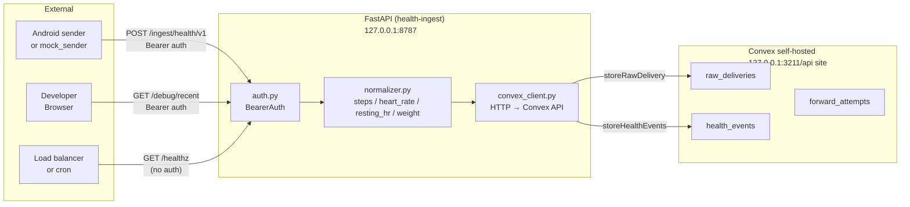

# Health Connect Webhook Ingest

A local Python server that receives webhook payloads from an Android Health Connect sender, validates and normalizes the data, stores it durably in Convex, and exposes developer-friendly endpoints for inspection.

---

## Architecture



**Data flow for a typical ingest:**

1. Android sender or mock sender sends `POST /ingest/health/v1` with a bearer token and JSON payload
2. `BearerAuth` middleware verifies the token — rejects with 401 if missing or wrong
3. Payload is parsed and validated against `IngestRequest` schema
4. Raw payload is stored to `raw_deliveries` in Convex with metadata (IP, user agent, hash, timestamp)
5. `Normalizer` transforms each record into a canonical `health_events` row
6. Canonical rows are stored to `health_events` in Convex
7. Response returned: `{"ok": true, "received_records": N, "stored_records": N, "delivery_id": "..."}`

---

## Features

- **Ingest endpoint** (`POST /ingest/health/v1`) — accepts Health Connect webhook payloads, validates bearer auth, stores raw + normalized data
- **Health check** (`GET /healthz`) — unauthenticated probe for load balancers and health checks
- **Debug endpoint** (`GET /debug/recent`) — inspect recent deliveries (auth required, gated by `ENABLE_DEBUG_ROUTES`)
- **Strict normalizer** — handles steps, heart_rate, resting_heart_rate, weight; raises on unknown types
- **Dedupe at event level** — raw deliveries are all kept; normalized events are fingerprinted to prevent duplicates
- **Mock sender** — CLI tool to send fixture payloads locally without a real phone/watch
- **Convex self-hosted** — SQLite-backed, zero ops overhead for local development
- **Bearer token auth** — single static token, no sender-side code changes needed

---

## Quick Start

### Prerequisites

- Python 3.12+
- Convex self-hosted backend running at `http://127.0.0.1:3210`

If Convex is not running:

```bash
cd convex-local
docker compose up
```

### Setup

```bash
# Create virtual environment
python3 -m venv .venv
source .venv/bin/activate

# Install dependencies
pip install -e .

# Copy env config
cp .env.example .env
# Edit .env and set:
#   INGEST_TOKEN=<your-token>
#   CONVEX_SELF_HOSTED_ADMIN_KEY=<from convex-local/.env>
```

### Run

```bash
# Start the server
./scripts/dev.sh

# In another terminal, send a test payload
python tools/mock_sender.py \
  --fixture fixtures/healthconnect_steps.json \
  --token your-token
```

### Test

```bash
./scripts/test.sh
# → 25 tests, all passing
```

---

## API Reference

### `POST /ingest/health/v1`

**Auth:** `Authorization: Bearer <INGEST_TOKEN>`

**Request body:**
```json
{
  "records": [
    {
      "record_type": "steps",
      "value": 8421,
      "unit": "count",
      "start_time_ms": 1713446400000,
      "end_time_ms": 1713489296000,
      "captured_at_ms": 1713489302000
    }
  ]
}
```

**Success response (200):**
```json
{
  "ok": true,
  "received_records": 1,
  "stored_records": 1,
  "delivery_id": "a1b2c3d4"
}
```

**Error responses:** `401` (auth failed), `413` (payload too large), `422` (malformed or unsupported record type), `500` (database error)

---

### `GET /healthz`

No auth.

```json
{"ok": true, "db": "ok"}
```

---

### `GET /debug/recent?limit=10`

**Auth:** `Authorization: Bearer <INGEST_TOKEN>`

Requires `ENABLE_DEBUG_ROUTES=true` in environment.

```json
{
  "deliveries": [
    {
      "delivery_id": "a1b2c3d4",
      "received_at": "2026-04-18T12:34:56Z",
      "record_count": 4,
      "status": "stored"
    }
  ]
}
```

---

## Supported Record Types

| Type | Value | Unit |
|------|-------|------|
| `steps` | integer | `count` |
| `heart_rate` | integer | `bpm` |
| `resting_heart_rate` | integer | `bpm` |
| `weight` | float | `kg` |

Other types (e.g., `blood_oxygen`, `sleep`, `distance`) are not supported and will cause a `422` response.

---

## Environment Variables

| Variable | Default | Description |
|----------|---------|-------------|
| `APP_ENV` | `development` | Runtime environment |
| `HOST` | `127.0.0.1` | Listen address |
| `PORT` | `8787` | Listen port |
| `INGEST_TOKEN` | `replace_me` | Bearer token for auth |
| `CONVEX_SELF_HOSTED_URL` | `http://127.0.0.1:3210` | Convex backend URL |
| `CONVEX_SELF_HOSTED_ADMIN_KEY` | — | Convex admin key |
| `ENABLE_DEBUG_ROUTES` | `true` | Enable/disable `/debug/*` routes |
| `MAX_BODY_BYTES` | `262144` | Max request body size (256 KB) |
| `OPENCLAW_WEBHOOK_URL` | — | Optional OpenClaw forwarding target |
| `OPENCLAW_WEBHOOK_TOKEN` | — | OpenClaw forwarding token |

---

## Project Structure

```
app/
  main.py              # FastAPI app factory
  config.py            # Settings via pydantic-settings
  auth.py              # BearerAuth middleware
  convex_client.py     # Convex HTTP client
  normalizer.py        # Webhook → canonical events
  models.py            # Canonical event model
  schemas.py           # Request/response Pydantic schemas
  routes/
    ingest.py         # POST /ingest/health/v1
    health.py         # GET /healthz
    debug.py          # GET /debug/recent

convex/                # Convex backend (sibling TypeScript project)
  schema.ts           # Table definitions
  healthIngester/
    mutations.ts      # storeRawDelivery, storeHealthEvents, checkDuplicateDelivery
    queries.ts       # listRecentDeliveries, checkDbHealth, etc.

fixtures/              # JSON test payloads
  healthconnect_steps.json
  healthconnect_heartrate.json
  healthconnect_weight.json
  healthconnect_mixed.json
  healthconnect_invalid_missing_fields.json
  healthconnect_duplicate_event.json

tools/
  mock_sender.py       # CLI tool to send fixture payloads

scripts/
  dev.sh              # Activate venv + run uvicorn
  test.sh             # Activate venv + run pytest

tests/
  conftest.py         # Shared pytest fixtures
  test_auth.py        # Auth middleware tests
  test_config.py      # Settings loading tests
  test_convex_client.py
  test_normalize.py   # Normalizer tests
  test_ingest.py      # End-to-end ingest tests
  test_validation.py # Payload validation tests
  test_models.py
  test_schemas.py
  test_main.py

docs/
  architecture/       # ADRs (source of truth)
    001-convex-as-database.md
    002-strict-normalizer.md
    003-bearer-token-auth.md
  superpowers/        # Planning artifacts
    specs/
      2026-04-18-health-ingest-mvp-design.md
    plans/
      2026-04-18-health-ingest-mvp-plan.md

AGENTS.md              # Agent guidance (docs/code sync rules)
CHANGELOG.md           # One-line per change, YYYY-MM-DD
pyproject.toml
.env.example
```

---

## Development

### Adding a new record type

1. Add the type to `normalizer.py`'s `SUPPORTED_TYPES` and `UNIT_MAP`
2. Add a test in `test_normalize.py`
3. Update `002-strict-normalizer.md` if the architectural stance changes
4. Append to `CHANGELOG.md`

### Capturing real payloads

When the Android sender is connected, capture real payloads and save them as new fixtures in `fixtures/`. Update the normalizer based on what actually arrives.

### Running against a live Convex backend

```bash
cd convex-local && docker compose up
# Backend available at http://127.0.0.1:3210
```

### Running the mock sender against a live server

```bash
source .venv/bin/activate
python tools/mock_sender.py \
  --fixture fixtures/healthconnect_mixed.json \
  --token $(grep INGEST_TOKEN .env | cut -d= -f2) \
  --jitter-hours 1 \
  --repeat 3
```
