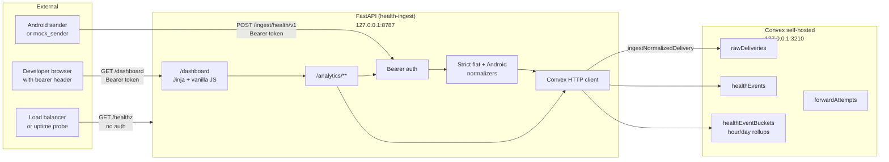

# Health Connect Webhook Ingest

A local-first FastAPI service that accepts Health Connect webhook payloads, normalizes them into a canonical event contract, stores raw and deduped data in Convex, and now exposes authenticated analytics APIs plus a built-in dashboard.

---

## Architecture



### What happens on ingest

1. `POST /ingest/health/v1` authenticates with a bearer token.
2. The payload is validated and auto-detected as either flat `records` format or nested Android format.
3. The normalizer emits canonical events with `deviceId`, `fingerprint`, and optional `metadata`.
4. A single Convex mutation stores the raw delivery, inserts only new events by fingerprint, and updates `hour`/`day` rollup buckets.
5. The response shape stays stable:

```json
{
  "ok": true,
  "received_records": 2,
  "stored_records": 1,
  "delivery_id": "delivery-123"
}
```

---

## Features

- **Idempotent ingest** — one Convex mutation stores the raw delivery, dedupes events by fingerprint, and updates analytics buckets.
- **Canonical event contract** — normalized events preserve `deviceId`, `externalId`, `fingerprint`, and optional `metadata`.
- **Dual payload support** — accepts both legacy flat `records` payloads and nested Android Health Connect payloads.
- **Analytics JSON APIs** — authenticated `/analytics/overview`, `/analytics/timeseries`, `/analytics/events`, and `/analytics/export.csv`.
- **Built-in dashboard** — authenticated `/dashboard` page served by FastAPI with Jinja2 templates and vanilla JavaScript.
- **Debug and health routes** — `/debug/recent` for recent deliveries and `/healthz` for unauthenticated health checks.
- **Convex self-hosted** — local SQLite-backed persistence without introducing a second database yet.

---

## Quick start

### Prerequisites

- Python 3.12+
- Convex self-hosted backend running at `http://127.0.0.1:3210`

If Convex is not already running:

```bash
cd convex-local
docker compose up
```

### Setup

```bash
python3 -m venv .venv
source .venv/bin/activate
pip install -e .
```

Create a local `.env` file in the repo root:

```dotenv
APP_ENV=development
APP_HOST=127.0.0.1
APP_PORT=8787
INGEST_TOKEN=replace_me
CONVEX_SELF_HOSTED_URL=http://127.0.0.1:3210
CONVEX_SELF_HOSTED_ADMIN_KEY=replace_me
ENABLE_DEBUG_ROUTES=true
ENABLE_ANALYTICS_ROUTES=true
MAX_BODY_BYTES=262144
OPENCLAW_WEBHOOK_URL=
OPENCLAW_WEBHOOK_TOKEN=
```

### Run the server

```bash
./scripts/dev.sh
```

### Send a fixture payload

```bash
python tools/mock_sender.py \
  --fixture fixtures/healthconnect_android_mixed.json \
  --token your-token
```

### Run the test suite

```bash
./scripts/test.sh
```

### Open the dashboard

The initial `GET /dashboard` request must include the same bearer token used by the API routes. After that authenticated page load, the dashboard reuses the verified token for its `/analytics/**` requests.

If you are using a browser, use a header extension or another tool that can send:

```text
Authorization: Bearer <INGEST_TOKEN>
```

---

## API overview

For the full current route contract, including auth expectations, query parameters, payload shapes, and response examples, see `docs/architecture/api-route-reference.md`.

### `POST /ingest/health/v1`

- **Auth:** required
- **Purpose:** validate a webhook payload, normalize records, store the raw delivery, dedupe events, and update rollups
- **Response:** `ok`, `received_records`, `stored_records`, `delivery_id`

### `GET /healthz`

- **Auth:** none
- **Purpose:** liveness/readiness check for the FastAPI app plus basic Convex connectivity

### `GET /debug/recent?limit=10`

- **Auth:** required
- **Gate:** `ENABLE_DEBUG_ROUTES=true`
- **Purpose:** recent raw-delivery inspection for local debugging

### `GET /analytics/overview`

- **Auth:** required
- **Gate:** `ENABLE_ANALYTICS_ROUTES=true`
- **Optional query params:** `from_ms`, `to_ms`, repeated `record_type`, `device_id`
- **Purpose:** per-record-type summary cards with count, min, max, avg, sum, and latest values

### `GET /analytics/timeseries`

- **Auth:** required
- **Gate:** `ENABLE_ANALYTICS_ROUTES=true`
- **Required query params:** `record_type`
- **Optional query params:** `bucket=hour|day`, `stat=count|sum|avg|min|max|latest_value`, `from_ms`, `to_ms`, `device_id`
- **Purpose:** time-series points for charts and trend views

### `GET /analytics/events`

- **Auth:** required
- **Gate:** `ENABLE_ANALYTICS_ROUTES=true`
- **Optional query params:** `from_ms`, `to_ms`, repeated `record_type`, `device_id`, `limit`
- **Purpose:** recent normalized events for inspection tables or downstream tooling

### `GET /analytics/export.csv`

- **Auth:** required
- **Gate:** `ENABLE_ANALYTICS_ROUTES=true`
- **Optional query params:** same filters as `/analytics/events`
- **Purpose:** quick CSV export of filtered normalized events

### `GET /dashboard`

- **Auth:** required
- **Gate:** `ENABLE_ANALYTICS_ROUTES=true`
- **Purpose:** built-in HTML dashboard for overview cards, a simple chart, recent events, and CSV export

---

## Supported payloads and canonical data

### Flat `records` payload

The legacy flat format remains supported for these record types:

- `steps`
- `heart_rate`
- `resting_heart_rate`
- `weight`

### Android nested payload

The Android normalizer currently accepts:

- `steps`
- `sleep`
- `heart_rate`
- `heart_rate_variability`
- `distance`
- `active_calories`
- `total_calories`
- `weight`
- `height`
- `oxygen_saturation`
- `resting_heart_rate`
- `exercise`
- `nutrition`
- `basal_metabolic_rate`
- `body_fat`
- `lean_body_mass`
- `vo2_max`

### Canonical event fields

Normalized events carry:

- `recordType`
- `valueNumeric`
- `unit`
- `startTime`
- `endTime`
- `capturedAt`
- optional `deviceId`
- optional `externalId`
- `payloadHash`
- `fingerprint`
- optional `metadata`

The current `exercise` mapping stores `duration_seconds` as the value and preserves `type` as `metadata.exerciseType`.

---

## Environment variables

| Variable | Default | Description |
| -------- | ------- | ----------- |
| `APP_ENV` | `development` | Runtime environment |
| `APP_HOST` | `127.0.0.1` | Listen address |
| `APP_PORT` | `8787` | Listen port |
| `INGEST_TOKEN` | `replace_me` | Bearer token for `/ingest/**`, `/debug/**`, `/analytics/**`, and `/dashboard` |
| `CONVEX_SELF_HOSTED_URL` | `http://127.0.0.1:3210` | Convex backend URL |
| `CONVEX_SELF_HOSTED_ADMIN_KEY` | — | Convex admin key |
| `ENABLE_DEBUG_ROUTES` | `true` | Enable or disable `/debug/**` |
| `ENABLE_ANALYTICS_ROUTES` | `true` | Enable or disable `/analytics/**` and `/dashboard` |
| `MAX_BODY_BYTES` | `262144` | Maximum request body size in bytes |
| `OPENCLAW_WEBHOOK_URL` | — | Optional downstream forwarding target |
| `OPENCLAW_WEBHOOK_TOKEN` | — | Optional downstream forwarding token |

---

## Project structure

```text
app/
  main.py
  auth.py
  config.py
  convex_client.py
  models.py
  normalizer.py
  schemas.py
  routes/
    ingest.py
    health.py
    debug.py
    analytics.py
    dashboard.py
  templates/
    dashboard.html
  static/
    dashboard.css
    dashboard.js

convex/
  schema.ts
  healthIngester/
    mutations.ts
    queries.ts

fixtures/
tools/
scripts/
tests/
docs/
  architecture/
    001-convex-as-database.md
    002-strict-normalizer.md
    003-bearer-token-auth.md
    004-analytics-read-model.md
    api-route-reference.md
```

---

## Development notes

### Adding or changing record types

1. Update `app/normalizer.py`.
2. Update `app/models.py` if the canonical contract changes.
3. Update or add pytest coverage in `tests/`.
4. Keep the ADRs, `README.md`, and `CHANGELOG.md` in sync.

### Local analytics scope

The current analytics read model is intentionally modest:

- hour/day rollup buckets live in Convex
- overview and event listing can still scan event rows when that is simpler or more accurate
- Postgres is intentionally deferred until real contention or query complexity makes it worth the extra operational weight

### Useful local commands

```bash
cd convex-local && docker compose up
./scripts/dev.sh
./scripts/test.sh
```
